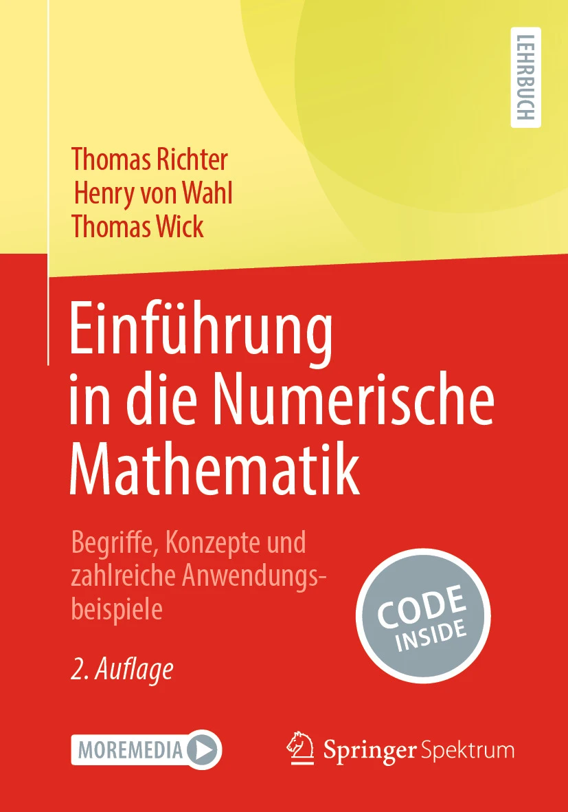

# EinfNumMath-RWW

Hier finden Sie Python-Programme zu den Beispielen im Lehrbuch [Richter et al., Einführung in die Numerische Mathematik, 2. Aufl.](https://link.springer.com/book/10.1007/978-3-662-69582-1) (Springer Spektrum, 2024).

Starten Sie die Übersicht der Notebooks mit
```
jupyter-notebook Inhaltsverzeichniss.ipynb
```
aus einer Konsole in diesem Verzeichnis.


